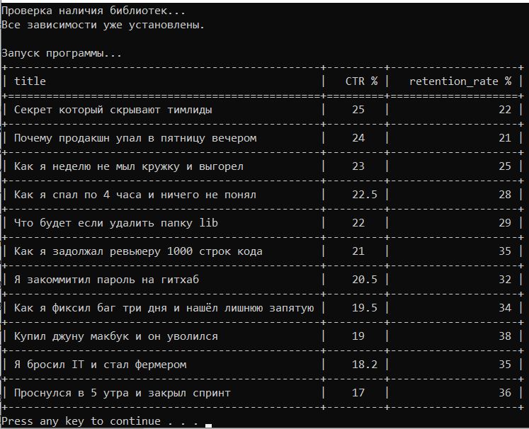

# Video Stats Analyzer

Инструмент для автоматического анализа статистики видеороликов. Программа позволяет фильтровать данные о видео по заданным критериям (кликбейт) и выводить структурированный отчет в консоль.

## Функционал

- **Загрузка данных:** поддерживает обработку нескольких CSV-файлов одновременно.
- **Фильтрация:** поиск видео с признаками кликбейта (высокий CTR при низком уровне удержания).
- **Сортировка:** результаты автоматически сортируются по CTR для удобства анализа.
- **Табличный вывод:** данные отображаются в виде читаемой таблицы прямо в терминале.

## Как запустить

### Быстрый старт (Windows)

Просто запустите файл **start.bat**. Он автоматически:

1. Проверит наличие необходимых библиотек в виртуальном окружении.
2. Установит их при необходимости (используя requirements.txt).
3. Запустит анализ данных из стандартных файлов stats1.csv и stats2.csv.

### Запуск через терминал

Если вы предпочитаете ручной запуск:
```bash
# Установка зависимостей
pip install -r requirements.txt
# Запуск программы с указанием нужных файлов
python main.py --files stats1.csv stats2.csv
```
# Тестирование

В проекте реализованы модульные тесты для проверки логики фильтрации. Тесты охватывают как стандартные случаи, так и граничные условия (например, значения ровно на границе фильтра).

# Как запустить тесты:

`pytest`

*Если все работает корректно, вы увидите отчет об успешном прохождении тестов (статус PASSED).*

# Структура проекта

- `main.py` — точка входа, обработка аргументов командной строки и вывод таблицы.
- `processor.py` — функции для чтения CSV-файлов и преобразования типов данных.
- `report.py` — основная логика фильтрации и сортировки статистики.
- `tests/` — папка с Unit-тестами (используется pytest).
- `start.bat` — скрипт для автоматизации проверки зависимостей и запуска.
- `requirements.txt` — список необходимых библиотек (tabulate, pytest).
- `stats1.csv`, `stats2.csv` — примеры файлов со статистикой для анализа. 

## Предварительный просмотр результатов


# Требования

Python 3.10 или выше.
Установленный менеджер пакетов pip.

# Video Stats Analyzer

A tool for automated analysis of video statistics. The program allows filtering video data based on specific criteria (clickbait) and displays a structured report in the console.

## Features

- **Data Loading:** Supports processing multiple CSV files simultaneously.
- **Filtering:** Detects videos with potential clickbait (high CTR with low retention).
- **Sorting:** Results are automatically sorted by CTR for easier analysis.
- **Table Output:** Data is displayed as a readable table directly in the terminal.

## How to Run

### Quick Start (Windows)

Simply run the **start.bat** file. It will automatically:

1. Check for necessary libraries in the virtual environment.
2. Install them if needed (using requirements.txt).
3. Run the analysis on the default stats1.csv and stats2.csv files.

### Manual Run

If you prefer to run it manually via the terminal:

```bash
# Install dependencies
pip install -r requirements.txt
# Run the program with the required files
python main.py --files stats1.csv stats2.csv
```
# Testing

The project includes unit tests to verify the filtering logic. The tests cover both standard cases and edge cases (e.g., values exactly at the filtering threshold).

# How to run tests:

`pytest`

*If everything is working correctly, you will see a report indicating that the tests passed (PASSED status).*

# Project Structure

- `main.py` — entry point, command-line argument processing, and table output.
- `processor.py` — functions for reading CSV files and type conversion.
- `report.py` — core logic for filtering and sorting statistics.
- `tests/` — directory containing unit tests (using pytest).
- `start.bat` — script to automate dependency checks and execution.
- `requirements.txt` — list of required libraries (tabulate, pytest).
- `stats1.csv`, `stats2.csv` — sample data files for analysis.

## Result Preview


# Requirements

Python 3.10 or higher.
Pip package manager installed.
